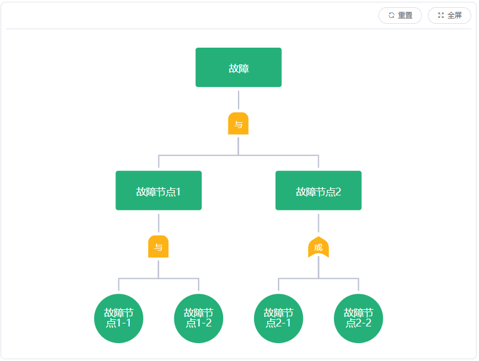
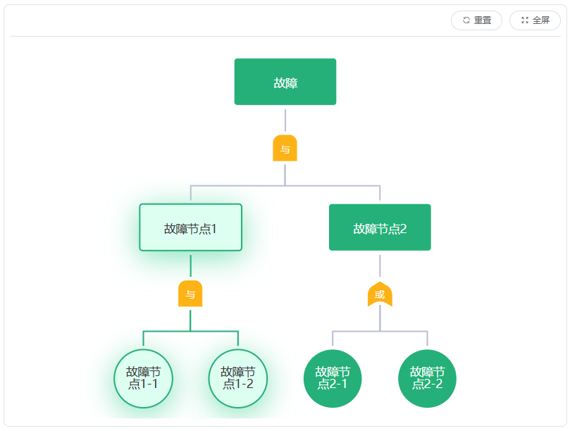
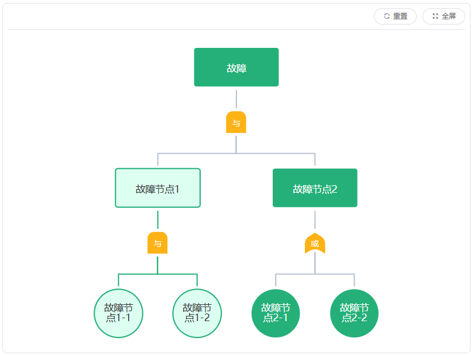
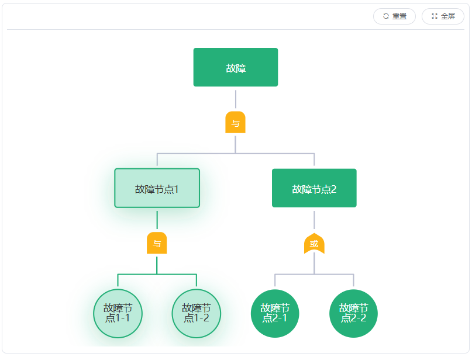
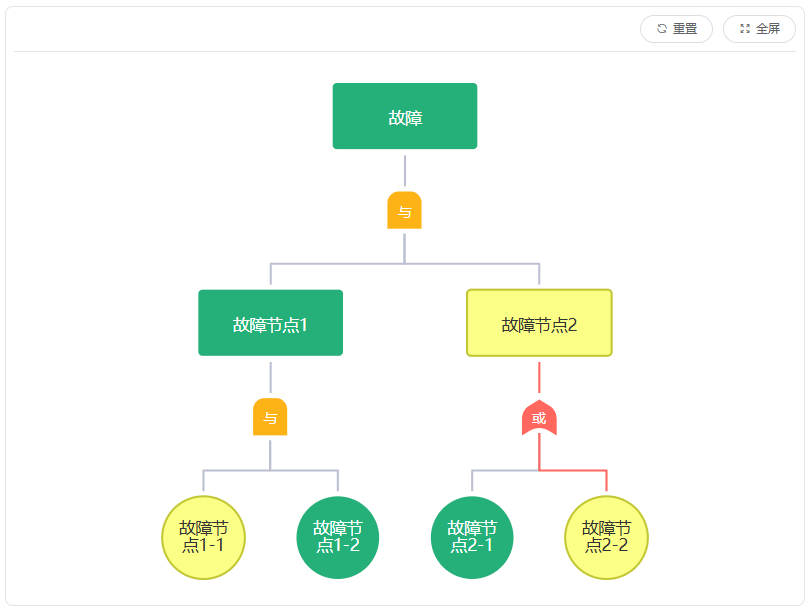
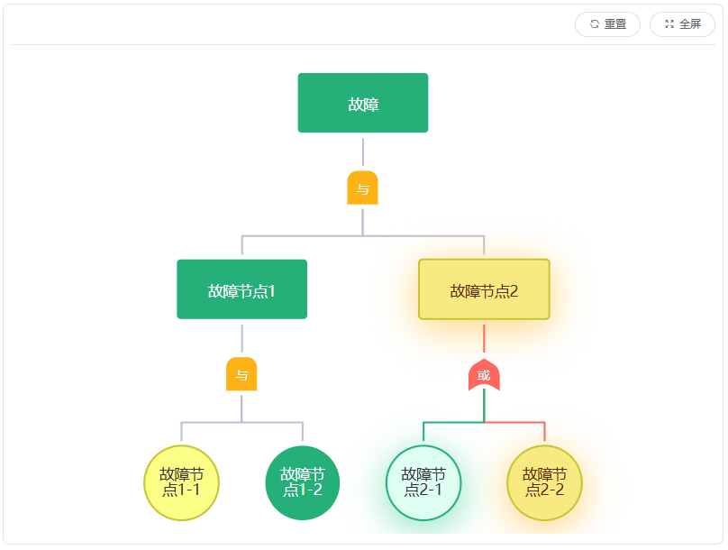
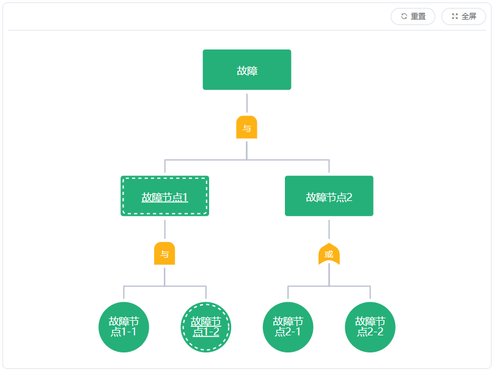

# fta-model

Vue2组件：基于 [jointJs](https://www.jointjs.com/) 的FTA（故障树分析）模型可视化组件

## 安装

```bash
npm install fta-model --save
```

## 说明 :bulb:

1. 本组件基于 jointJs 实现，使用前请先引入 jointJs 的相关依赖，具体包括以下文件：  

   - joint.js
   - graphlib.core.js
   - dagre.js
   - directed-graph.js

2. 引入步骤
    - 将node_modules/fta-model/src下的libs目录，复制到项目的public/js目录下。
    - 在public/index.html的 **head** 标签中添加以下代码：
  
        ```html
        <script src="<%= BASE_URL %>js/libs/joint.js"></script>
        <script src="<%= BASE_URL %>js/libs/graphlib.core.js"></script>
        <script src="<%= BASE_URL %>js/libs/dagre.js"></script>
        <script src="<%= BASE_URL %>js/libs/directed-graph.js"></script>
        ```

    - 验证是否引入成功：在上一步添加的代码后加入以下代码，运行项目，打开控制台查看打印内容，打印值不为undefined即表示引入成功。
  
        ```html
        <script>
            console.log('window.graphlib:', window.graphlib)
            console.log('window.dagre:', window.dagre)
            console.log('window.joint:', window.joint)
        </script>
        ```
  
## 使用

```js
# 全局引入 main.js
import FtaModel from 'fta-model'
Vue.use(FtaModel)

# 局部引入 page.vue
import { FtaModel } from 'fta-model'
export default {
  components: { FtaModel } 
}
```

```vue
# page.vue
# 注意：FtaModel组件或者其父元素需要设置宽高，否则无法显示
<fta-model :data="graphData" style="width: 800px; height: 600px" />
```

## 属性

| 属性名        | 类型     | 默认值 | 可选值 | 说明                                                        |
| ------------- | -------- | ------ | ------ | ----------------------------------------------------------- |
| data          | array    | []     | -      | 故障模型数据（树状），数据结构参见[data数据项](#data数据项) |
| showCaseState | boolean  | false  | -      | 显示用例配置状态（内边框、下划线）                          |
| caseStateFunc | function | null   | -      | 用例配置状态判断方法（不传则使用内置判断逻辑）              |

### data数据项

| 属性名        | 类型   | 值范围 | 说明                                       |
| ------------- | ------ | ------ | ------------------------------------------ |
| parentId      | string | -      | 父节点id，为0标识根节点                    |
| nodeId        | string | -      | 节点id                                     |
| nodeType      | string | H/I/L  | 节点类型，H-根节点，I-中间节点，L-叶子节点 |
| faultName     | string | -      | 节点名称                                   |
| subsetLogic   | string | AND/OR | 子集组合逻辑，AND-与，OR-或                |
| children      | array  | -      | 子集                                       |
| caseCount     | array  | -      | 节点绑定用例数量                           |
| terminalCount | array  | -      | 适配终端数量                               |

## 事件

| 事件名      | 参数             | 说明                                                   |
| ----------- | ---------------- | ------------------------------------------------------ |
| render-done | -                | 渲染完毕，此时可通过refs获取实例                       |
| node-click  | {nodeId,nodeRaw} | 节点点击时触发事件（点击空白处也会触发，相应参数为空） |

## 方法

| 方法名          | 参数    | 说明                                       |
| --------------- | ------- | ------------------------------------------ |
| setHighlight    | nodeId  | 高亮节点及其子节点，只能存在一个高亮的分支 |
| removeHighlight | -       | 移除高亮                                   |
| centerElement   | nodeId  | 节点居中                                   |
| setDiagnose     | nodeIds | 设置诊断节点                               |
| removeDiagnose  | nodeIds | 移除诊断节点，nodeIds可不传，默认移除所有  |
| setFault        | nodeIds | 设置故障节点                               |
| removeFault     | nodeIds | 移除故障节点，nodeIds可不传，默认移除所有  |

## 示例

1. 基础样式
   - 默认
    

   - 高亮
    

2. 诊断样式
   - 默认
    

   - 高亮
    

3. 故障样式
   - 默认
    

   - 高亮
    

4. 显示用例配置状态
   
